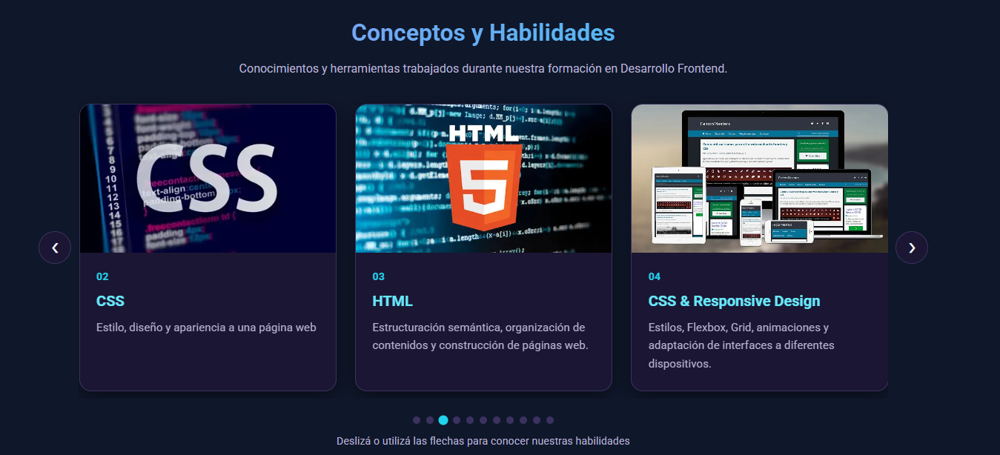
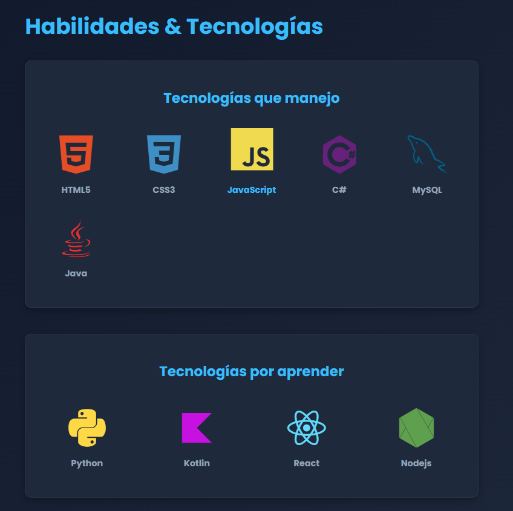
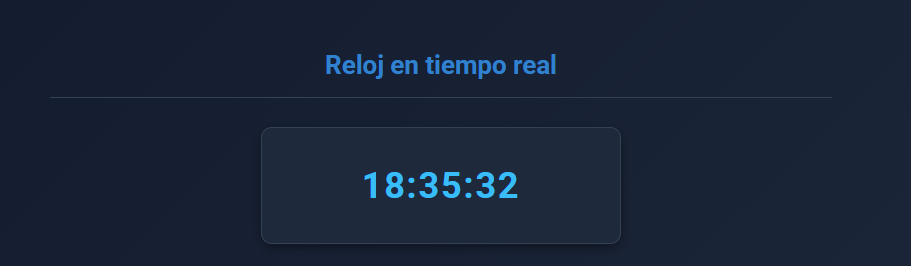
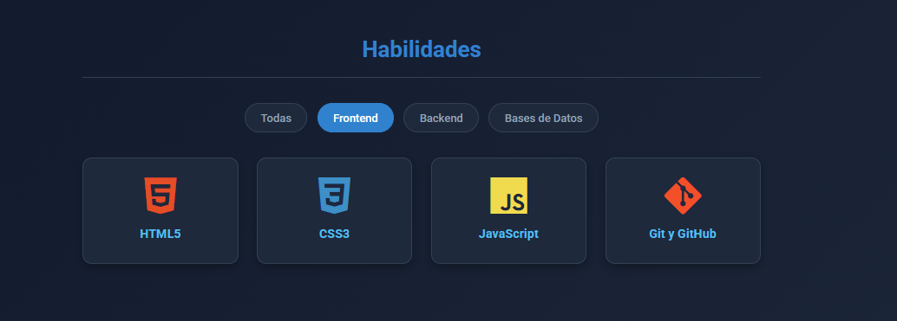
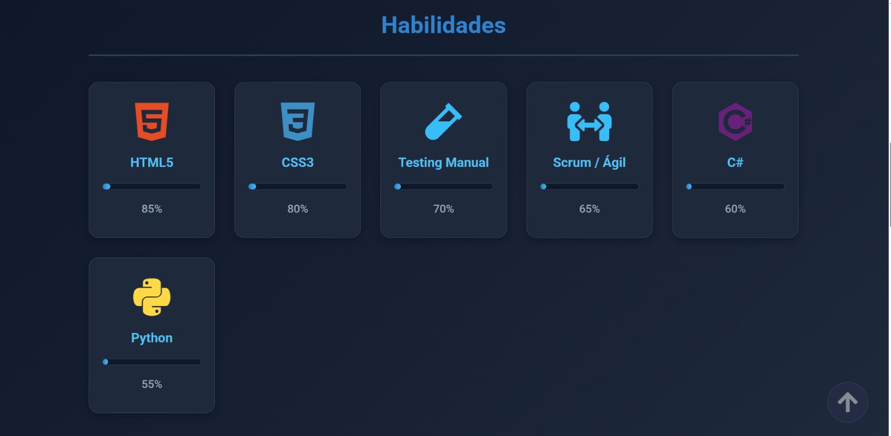
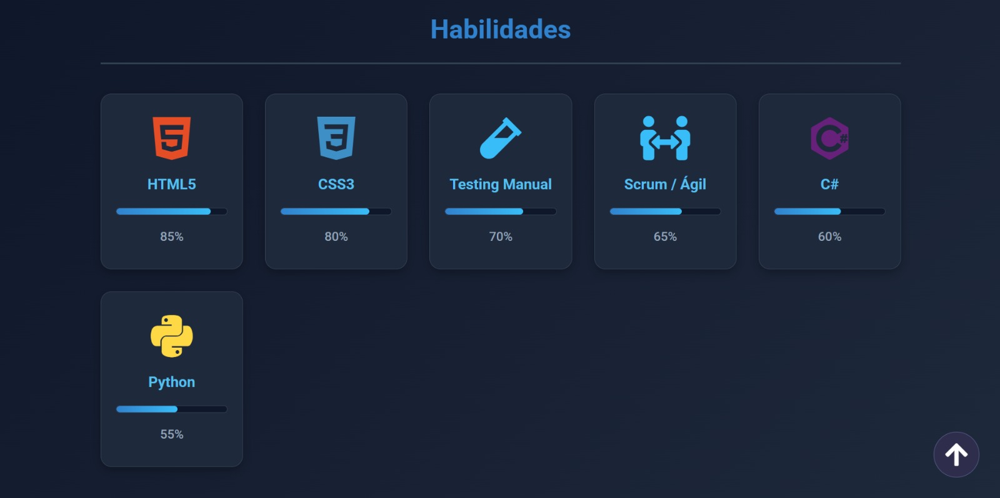
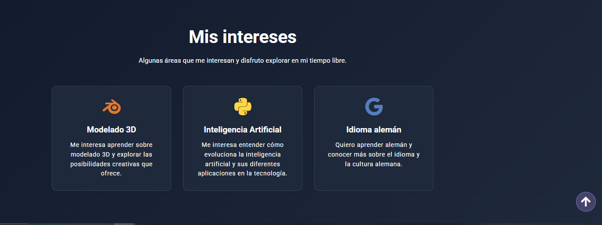
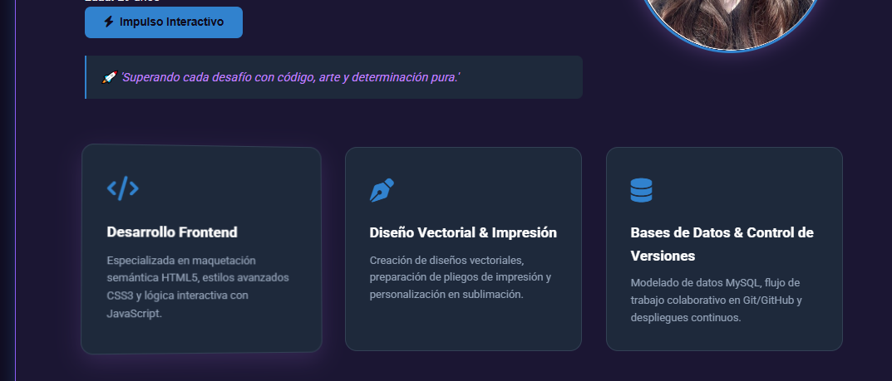

# 🚀 TechArg — Proyecto Web TP1 🚀


---

## 👥 Integrantes

| Nombre | GitHub |
| :--- | :--- |
| Mariana Sosa | [@MaruSosa](https://github.com/MaruSosa) |
| Miguel Marcaida | [@Miguel-Marcaida](https://github.com/Miguel-Marcaida) |
| Carolina Silva Cotto | [@csilvacotto-2202](https://github.com/csilvacotto-2202) |
| Sergio Cesar Barrientos | [@SergioCesarBarrientos](https://github.com/SergioCesarBarrientos) |
| Karina Sánchez | [@karinaluciasanz](https://github.com/karinaluciasanz) |

---

## 📌 Descripción del Proyecto

**TechArg** es una plataforma web colaborativa desarrollada para la materia **Desarrollo de Sistemas Web (Front End)** del 2º Cuatrimestre de la **Tecnicatura Superior en Desarrollo de Software a Distancia (IFTS 29)**.

El sitio funciona como portal oficial de presentación de nuestro equipo de desarrollo e incluye:

* 🏠 **Portada (Inicio):** Presentación del grupo, propuesta de valor y acceso directo al equipo.
* 👤 **Perfiles Individuales:** Tarjetas de presentación de cada integrante con sus habilidades, gustos de películas, música y datos de contacto.
* 📓 **Bitácora de Desarrollo:** Registro de las decisiones de diseño, dificultades técnicas superadas y la evolución del proyecto.
* 🎯 **Navegación Dinámica:** Menú responsive con desplegable (*dropdown*) para acceder a los perfiles e interacciones dinámicas con JavaScript.

🔗 **Sitio Web Publicado (Vercel):** [https://techarg-tp1.vercel.app](https://techarg-tp1.vercel.app)

## 📁 Estructura del Proyecto

```
TPGrupal1-Front-End/
├── index.html              ← Portada del equipo
├── mariana.html            ← Perfil de Mariana
├── miguel.html             ← Perfil de Miguel
├── carolina.html           ← Perfil de Carolina
├── sergio.html             ← Perfil de Sergio
├── karina.html             ← Perfil de Karina
├── bitacora.html           ← Bitácora del proceso
├── css/
│   ├── styles.css          ← Estilos generales (index + bitácora)
│   ├── mariana.css         ← Estilos del perfil de Mariana
│   ├── miguel.css          ← Estilos del perfil de Miguel
│   ├── carolina.css        ← Estilos del perfil de Carolina
│   ├── sergio.css          ← Estilos del perfil de Sergio
│   └── karina.css          ← Estilos del perfil de Karina
├── js/
│   ├── main.js             ← Menú hamburguesa, saludo, carrusel, botón "Volver arriba"
│   ├── mariana.js          ← Barras de habilidades, recomendador al azar
│   ├── miguel.js           ← Reloj, filtro, "Ver más", "Top 3"
│   ├── carolina.js         ← Barras de habilidades, recomendador al azar
│   ├── sergio.js           ← Botón "Volver arriba"
│   └── karina.js           ← Frases motivadoras, efecto 3D
├── img/
│   ├── logoItfs.png
│   ├── miguel/
│   │   └── avatar-miguel.png
│   ├── carolina/
│   │   └── carolina-foto.png
│   ├── sergio/
│   │   └── yo.png
│   └── karina/
│       └── perfil.png
└── README.md
```

## 🛠️ Tecnologías Utilizadas

* 🔹 **HTML5:** Estructuración semántica de todas las páginas.
* 🔹 **CSS3:** Variables CSS (`:root`), Flexbox, CSS Grid, animaciones y media queries.
* 🔹 **JavaScript (ES6+):** Manipulación del DOM, eventos e interactividad dinámica.
* 🔹 **Font Awesome:** Iconografía vectorial.
* 🔹 **Vercel:** Despliegue continuo y hosting.
* 🔹 **Git & GitHub:** Control de versiones y trabajo colaborativo.

---

## 🎨 Guía de Estilos

### Paleta de Colores Hexadecimal

* 💜 **Primary Color:** `#8b5cf6` (Violeta Principal)
* 💜 **Primary Hover:** `#7c3aed` (Violeta Oscuro)
* 🩵 **Secondary Color:** `#22d3ee` (Cian Neón / Acento)
* 🩵 **Secondary Hover:** `#06b6d4` (Cian Oscuro)
* 🌌 **Background Color:** `#0f0b1f` (Fondo Oscuro General)
* 💳 **Card Background:** `#1b1633` (Fondo de Tarjetas)
* 🔳 **Border Color:** `#3b3260` (Bordes y Separadores)

### Tipografía

* ✍️ **Fuente Principal:** `"Roboto", sans-serif` (Google Fonts)
* ✍️ **Fuente Footer:** `"Rubik", sans-serif` (Google Fonts)

### Breakpoints Adaptativos

* 📱 **Mobile (< 400px):** Menú hamburguesa, carrusel de 1 tarjeta por vista.
* 📐 **Tablet (400px - 900px):** Navegación intermedia, carrusel de 2 tarjetas por vista.
* 💻 **Desktop (> 900px y 1200px):** Menú expandido con dropdown, grilla de 3 columnas, carrusel de 3 tarjetas por vista.

---

## ⚙️ Funciones JavaScript e Interactividad

### 1. Portada (`index.html` / `js/main.js`)

| Función | Descripción |
| :--- | :--- |
| **Menú Hamburguesa** | Alterna la clase `.open` en el nav y cambia el ícono de barras a equis. |
| **Saludo Dinámico** | Muestra "Buenos días", "Buenas tardes" o "Buenas noches" según la hora del visitante. |
| **Carrusel de Habilidades** | Carrusel infinito con autoplay, navegación por botones, puntos indicadores, swipe en móvil y pausa al pasar el mouse. |
| **Botón "Volver arriba"** | Aparece al hacer scroll (`window.scrollY > 300`) y vuelve al inicio con `window.scrollTo({ behavior: "smooth" })`. |
| **Carrusel de Habilidades** | Carrusel infinito con autoplay, navegación por botones, puntos indicadores, swipe en móvil y pausa al pasar el mouse.<br> |

### 2. Perfiles Individuales

| Perfil | Función | Descripción |
| :--- | :--- | :--- |
| **Mariana** (`js/mariana.js`) | Barras de nivel de habilidades | Anima el ancho de cada barra con `IntersectionObserver` cuando la sección entra en pantalla.<br> |
| | Recomendador de disco al azar | Elige un artista al azar, resalta su tarjeta y muestra una recomendación. |
| **Miguel** (`js/miguel.js`) | Reloj en tiempo real | Actualiza la hora cada segundo con `setInterval()`.<br> |
| | Filtro de habilidades | Filtra por categoría (frontend, backend, bases de datos) con `dataset` y `style.display`.<br> |
| | "Ver más" en películas | Expande la sinopsis con `classList` y `textContent`. |
| | "Top 3" en discos | Muestra los 3 temas favoritos de cada artista. |
| **Carolina** (`js/carolina.js`) | Barras de nivel de habilidades | Anima el ancho con `IntersectionObserver`.<br>  |
| | Recomendador de disco al azar | Elige un cantante al azar y lo muestra como recomendación. |
| **Sergio** (`js/sergio.js`) | Botón "Volver arriba" | Aparece al hacer scroll y vuelve al inicio con `window.scrollTo({ behavior: "smooth" })`.<br> |
| **Karina** (`js/karina.js`) | Frases motivadoras | Al hacer clic en un botón, cambia una frase con transición de opacidad.<br> |
| | Efecto 3D en tarjetas | Aplica rotación 3D con `perspective`, `rotateX`, `rotateY` y `scale3d` al mover el mouse. |
---

## 🤖 Uso de Inteligencia Artificial y Criterio de Autoría

De acuerdo con las pautas del trabajo práctico, el equipo utilizó herramientas de Inteligencia Artificial como asistente técnico:

* 🛠️ **Herramientas utilizadas:** ChatGPT y Claude 3.5 Sonnet (Planes gratuitos).
* 💻 **Asistencia en Código:** Apoyo en optimización de sintaxis Flexbox y CSS Grid, y cálculos para el carrusel interactivo.
* 🔍 **Debugging:** Identificación y corrección de errores en eventos dinámicos y clases del CSS.
* 🖼️ **Imágenes y Avatares:** Uso de prompts específicos para generar avatares con estética neón en tono oscuro.
* 👥 **Criterio propio:** Todo el código y las respuestas generadas por la IA fueron adaptadas, integradas y testeadas por los integrantes del equipo.

---

## 📈 Evolución y Próximos Pasos

1. ⚙️ Implementación de un backend en Node.js para el envío de formularios de contacto en producción.
2. 🌙 Persistencia de estado de temas (Modo Oscuro / Claro) mediante `localStorage`.
3. 📦 Componentización del sitio en un framework como React o Vue.js.

---

*Desarrollado con ❤️ por el equipo TechArg — IFTS 29 (2026)*